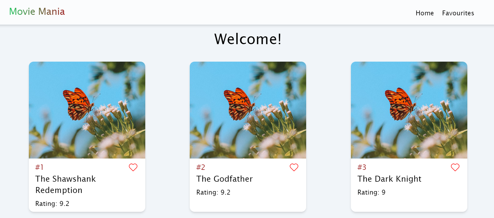

# Movie Mania

Movie Mania is a responsive React application that enables users to explore a curated list of movies, mark their favorites, and view them later. With an intuitive interface and seamless navigation, Movie Mania provides an engaging experience for movie enthusiasts.

## Features

- Browse a sorted list of movies fetched from an external API.
- Mark/unmark movies as favorites and view them in a dedicated favorites list.
- Responsive design ensures optimal viewing experience across devices.
- Seamless navigation with the ability to view IMDb details of each movie.

## Technologies Used

- React
- Redux Toolkit
- React Router
- Tailwind CSS
- React Hot Toast
- React Icons

## Installation Process

1. Clone the repository:
`git clone https://github.com/Miraj8280/movie-mania.git`

2. Navigate to the project directory:
`cd movie-mania`

3. Install dependencies:
`npm install`

4. Create a `.env` file in the root directory and add the following:
`VITE_API_BASE_URL=https://dummyapi.online/api/`

5. Start the development server:
`npm run dev`

6. Open your web browser and navigate to `http://localhost:5173` to view the application.

### Happy Coding!